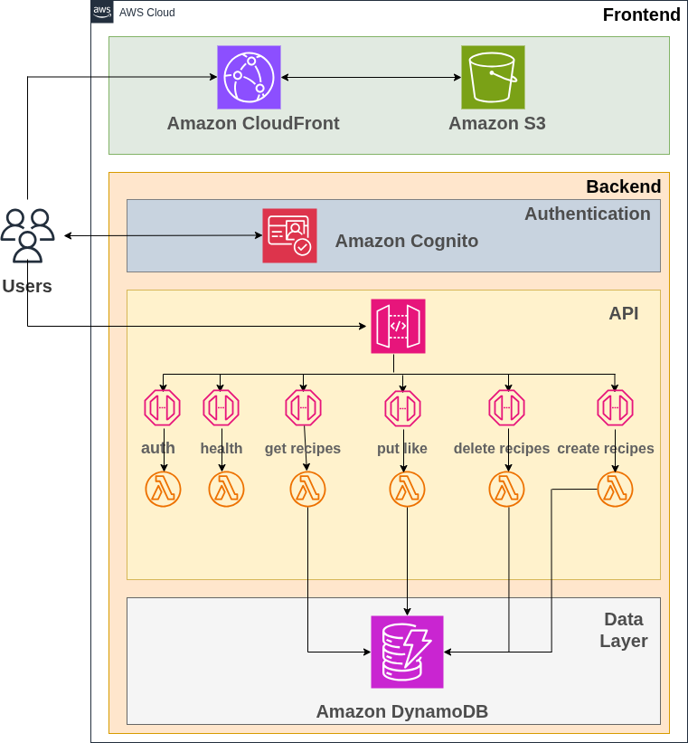
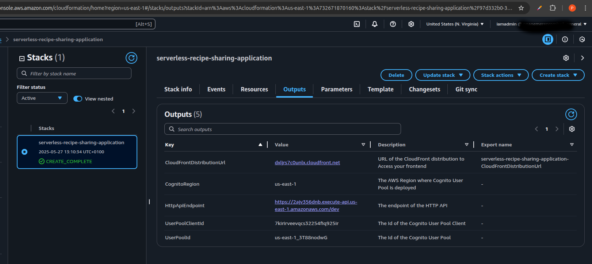
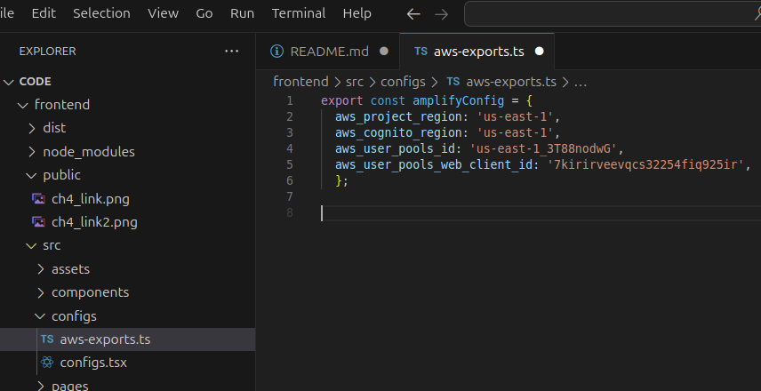

# 🥘 Serverless Recipe App

This is the serverless version of my recipe-sharing application, rebuilt entirely using AWS **serverless technologies**.

---

## 🎯 What You'll Learn

- How to build a **fully serverless application** with AWS
- Set up **Cognito authentication** for secure access
- Use **API Gateway** and **Lambda** for backend logic
- Host React frontend using **S3 + CloudFront**
- Deploy via **CloudFormation**

---

## Media

| Preview | Description |
|--------|-------------|
| 📸  | Project Architecture |
| 📸  | Stack Created Successfully |
| 🎥 [demo](media/demo.webm) | Demonstration of Application Usage |
| 📸  | Cognito User Pool Configuration |

---

## 🚀 Features

✅ Fully serverless architecture  
✅ Built with **React.js + Vite**  
✅ Lambda backend with RESTful APIs  
✅ Cognito authentication (user pools, identity pools)  
✅ Secure S3 hosting + CloudFront CDN  
✅ Supports recipe media/media  

---

## 🛠️ AWS Resources Used

| Layer        | Services Used |
|--------------|---------------|
| **Frontend** | S3, CloudFront |
| **Backend**  | API Gateway, Lambda |
| **Auth**     | Amazon Cognito |
| **Infra**    | CloudFormation |

---

## 🧱 Architecture Overview

- API Gateway -> Lambda
- Cognito for user sign-in
- S3 bucket for media and frontend assets
- CloudFront for content delivery
- CloudFormation to deploy the stack

---

## 🧪 Local Development

### Frontend
```bash
cd frontend
npm install && npm run build
```

##  🧱 Deployment Instructions

1. **Deploy the Stack**

```bash
aws cloudformation deploy \
  --template-file platform/ch4-application-template.yaml \
  --stack-name serverless-recipe-app \
  --capabilities CAPABILITY_NAMED_IAM
```

2. **Frontend configuration**

- Navigate to the …/frontend/src/configs folder, and edit the variables and configurations in the files aws-exports.ts and configs.tsx according to your CloudFormation output.


3. **Upload Frontend to S3**

```bash
cd frontend/
npm run build
aws s3 sync dist/ s3://your-s3-bucket-name
```
---

## 📌 Future Improvements

- Enrich your application with media content for the recipe
- Add user profile

---

## 📄 License

MIT license

---

## 🙋‍♂️ Author

Promise Ugochukwu Nnanemere

[🔗 LinkedIn](https://linkedin.com/in/promiseugochukwunnanemere)
